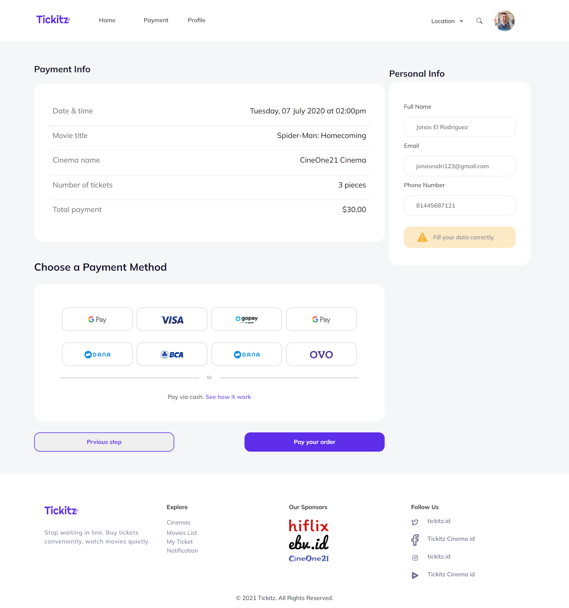

# Tickitz-Frontend

<p>Hello, i made website <b>Tickitz</b> use HTML,CSS, and Bootstrap, you can see my website <a href="https://tickitz-demo-web.netlify.app">here</a></p>

## Installation
```sh
git clone https://github.com/riyaraa/Tickitz-Frontend.git
cd Tickitz-Frontend
open your browser Home.html
```

## Demo

<details>
  <summary>
    Home Page
  </summary>

</details>

<details>
  <summary>
    Home Page Mobile 
  </summary>

</details>

<details>
  <summary>
   Detail Movie
  </summary>

</details>

<details>
  <summary>
   Detail Movie Mobile 
  </summary>

</details>

<details>
  <summary>
    Order Page
  </summary>

</details>

<details>
  <summary>
   Order Page Mobile
  </summary>

</details>

<details>
  <summary>
    Payment Page
  </summary>

</details>

<details>
  <summary>
   Payment Page Mobile
  </summary>

</details>
